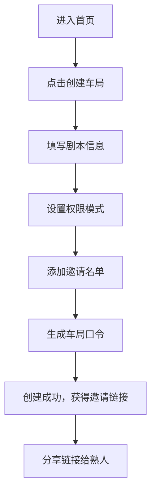
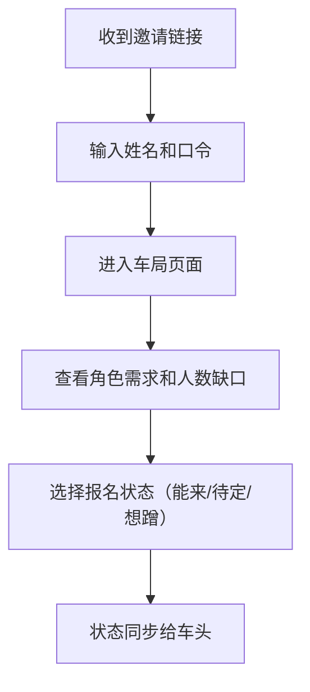
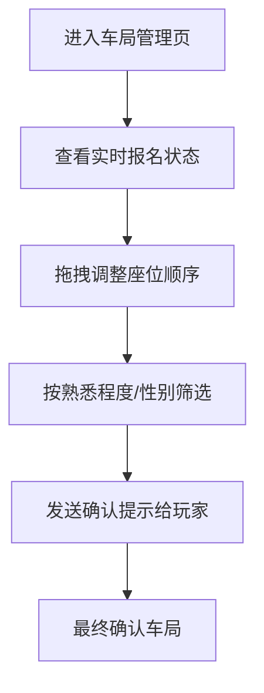

## 1. 产品概述

熟人剧本杀组局台是一款面向剧本杀小圈子的私密组局工具，解决车头（组织者）在微信群中反复询问、信息刷屏、座位混乱的痛点。通过带口令的私密车局页，车头可以高效管理剧本信息、邀请熟人、确认座位，玩家则能清晰看到角色需求和报名状态。

- **目标用户**：经常组织固定剧本杀小圈子的玩家（车头）及其熟人圈
- **核心价值**：减少群聊刷屏，提升组局效率，保护剧本信息私密性
- **产品定位**：轻量级、私密化、熟人社交向的剧本杀组局工具

## 2. 核心功能

### 2.1 用户角色

| 角色 | 进入方式 | 核心权限 |
|------|----------|----------|
| 车头（组织者） | 创建车局后自动成为车头 | 编辑车局信息、管理邀请名单、调整座位顺序、发送确认提示、查看完整数据 |
| 受邀玩家 | 通过带口令的链接+姓名进入 | 查看与自己相关的角色需求、标记报名状态（能来/待定/想蹭）、查看基本车局信息 |

### 2.2 功能模块

1. **首页/车局列表**：展示我创建的车局、我参与的车局、创建新车局入口
2. **车局创建页**：填写剧本信息、设置权限、生成带口令的车局
3. **车局详情页（车头视角）**：实时座位表、邀请名单管理、拖拽排序、确认提示
4. **车局详情页（玩家视角）**：角色需求展示、报名状态切换、基本信息查看

### 2.3 页面详情

| 页面名称 | 模块名称 | 功能描述 |
|-----------|-------------|---------------------|
| 首页 | 车局列表 | 展示进行中的车局卡片，显示剧本名称、时间、人数进度 |
| 首页 | 创建入口 | 大按钮快速创建新车局 |
| 车局创建页 | 剧本信息表单 | 本名、类型、时长、店家、预计人均、可选时间段输入 |
| 车局创建页 | 权限设置 | 只允许受邀查看 / 可由熟人转邀一次 |
| 车局创建页 | 邀请名单 | 添加/删除熟人姓名，支持批量添加 |
| 车局创建页 | 口令生成 | 自动生成4位数字口令，可手动修改 |
| 车局详情页（车头） | 剧本信息卡 | 展示完整剧本信息，可编辑 |
| 车局详情页（车头） | 座位表 | 拖拽排序、按熟悉程度/性别/优先级筛选 |
| 车局详情页（车头） | 邀请管理 | 添加新邀请、复制邀请链接、查看报名状态 |
| 车局详情页（车头） | 确认提示 | 一键发送确认提醒给未确认玩家 |
| 车局详情页（玩家） | 我的状态卡片 | 显示我的报名状态、可切换状态 |
| 车局详情页（玩家） | 角色需求展示 | 展示所需角色类型、当前缺口 |
| 车局详情页（玩家） | 车局基本信息 | 剧本名称、时间、地点等基本信息 |

## 3. 核心流程

### 3.1 车头创建车局流程

### 3.2 玩家报名流程

### 3.3 车头管理座位流程

## 4. 用户界面设计

### 4.1 设计风格

- **设计调性**：神秘剧场风 - 深色调背景配合暖金点缀，营造剧本杀的悬疑感和社交温度
- **主色调**：深靛蓝 `#1a1a2e` 作为背景主色，暖金色 `#e94560` 作为强调色
- **辅助色**：墨绿 `#16213e`、琥珀金 `#f5b971`、象牙白 `#eaeaea`
- **按钮风格**：圆角矩形，微妙的内阴影，悬停有轻微浮起效果
- **字体**：标题使用「思源宋体」营造戏剧感，正文使用「思源黑体」保证可读性
- **布局风格**：卡片式布局，深色玻璃拟态效果，层次分明
- **图标风格**：线性图标，金色描边，简洁优雅

### 4.2 页面设计概述

| 页面名称 | 模块名称 | UI 元素 |
|-----------|-------------|-------------|
| 首页 | Hero 区域 | 大标题「今晚开哪本？」、副标题、创建按钮 |
| 首页 | 车局列表 | 卡片式布局，每张卡片显示剧本名、状态标签、人数进度条、时间 |
| 车局创建页 | 表单区域 | 分组表单，深色输入框，金色聚焦边框，标签左对齐 |
| 车局创建页 | 邀请名单 | 标签式展示，可删除，输入框自动补全建议 |
| 车局详情页（车头） | 座位表 | 拖拽卡片，头像+姓名+状态标签，按列分组 |
| 车局详情页（车头） | 工具栏 | 筛选按钮、排序选项、批量操作 |
| 车局详情页（玩家） | 状态卡片 | 大卡片展示当前状态，三选一状态按钮 |
| 车局详情页（玩家） | 信息区 | 折叠式面板，依次展示剧本、时间、地点信息 |

### 4.3 响应式

- 桌面端优先设计，使用 Tailwind 响应式断点适配平板和手机
- 移动端简化布局，单列展示，底部操作栏
- 触摸优化：加大点击区域，支持滑动手势

### 4.4 交互动效

- 页面切换：淡入淡出 + 轻微上移动画
- 卡片悬停：轻微上浮 + 阴影加深
- 状态切换：平滑过渡动画，颜色渐变
- 拖拽排序：半透明跟随效果，目标位置高亮
- 加载状态：骨架屏 + pulse 动画
