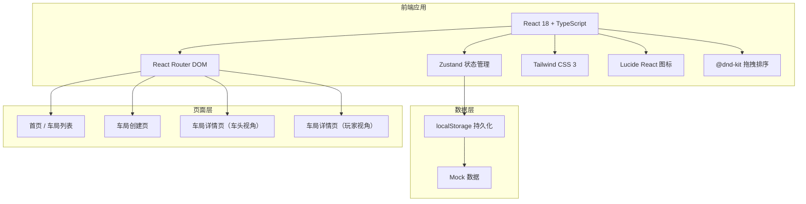
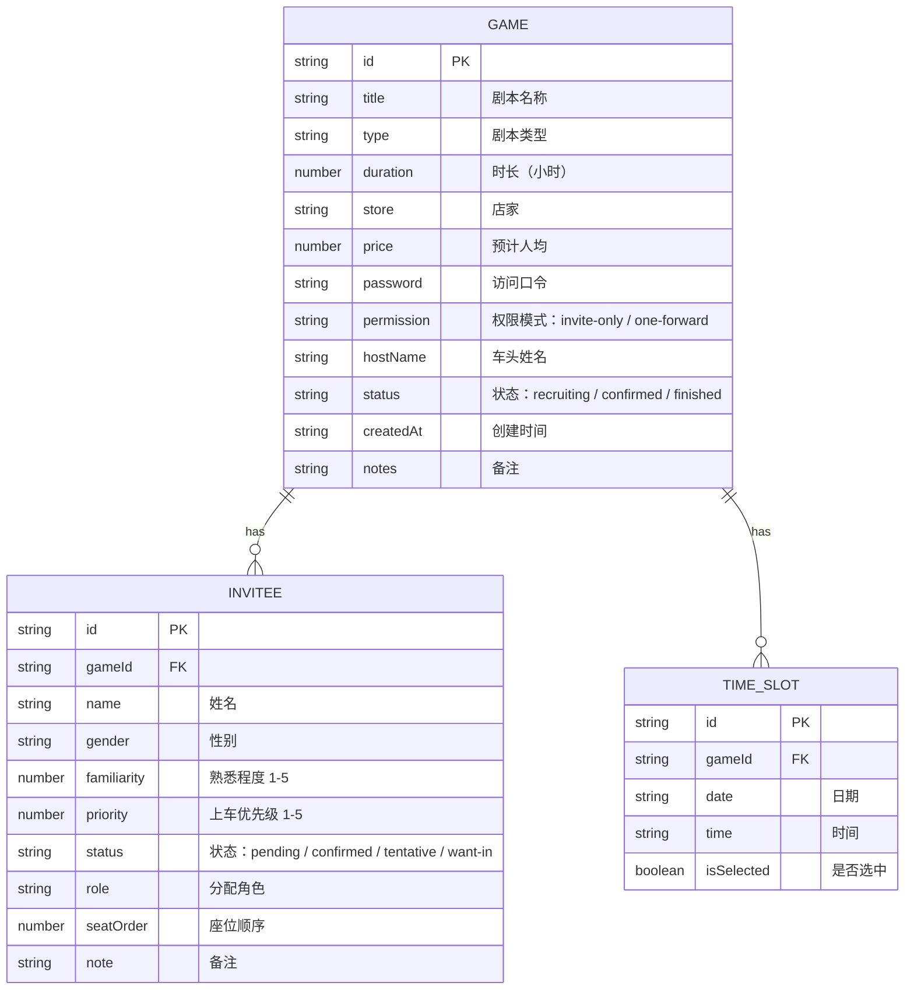

## 1. 架构设计



## 2. 技术描述

- **前端框架**：React 18 + TypeScript
- **构建工具**：Vite 5
- **路由管理**：react-router-dom 6
- **状态管理**：zustand 4
- **样式方案**：Tailwind CSS 3
- **拖拽功能**：@dnd-kit/core + @dnd-kit/sortable
- **图标库**：lucide-react
- **数据持久化**：localStorage（前端模拟后端）
- **初始化方式**：vite-init react-ts 模板

## 3. 路由定义

| 路由 | 页面 | 说明 |
|-------|------|------|
| `/` | 首页 / 车局列表 | 展示我创建的车局和参与的车局 |
| `/create` | 车局创建页 | 创建新车局，填写剧本信息、邀请名单、权限设置 |
| `/game/:id` | 车局详情页 | 根据 URL 参数和身份显示不同视角（车头/玩家） |
| `/game/:id/host` | 车头管理页 | 车头专属管理界面，座位调整、确认提示 |

## 4. 数据模型

### 4.1 数据模型定义



### 4.2 TypeScript 类型定义

```typescript
// 车局状态
type GameStatus = 'recruiting' | 'confirmed' | 'finished';

// 权限模式
type PermissionMode = 'invite-only' | 'one-forward';

// 玩家状态
type PlayerStatus = 'pending' | 'confirmed' | 'tentative' | 'want-in';

// 性别
type Gender = 'male' | 'female' | 'unknown';

// 时间段
interface TimeSlot {
  id: string;
  date: string;
  time: string;
  isSelected: boolean;
}

// 受邀玩家
interface Invitee {
  id: string;
  gameId: string;
  name: string;
  gender: Gender;
  familiarity: number; // 1-5
  priority: number; // 1-5
  status: PlayerStatus;
  role?: string;
  seatOrder: number;
  note?: string;
}

// 车局
interface Game {
  id: string;
  title: string;
  type: string;
  duration: number;
  store: string;
  price: number;
  password: string;
  permission: PermissionMode;
  hostName: string;
  status: GameStatus;
  createdAt: string;
  notes?: string;
  timeSlots: TimeSlot[];
  invitees: Invitee[];
  requiredPlayers: number; // 需要的总人数
}
```

## 5. 状态管理设计

### 5.1 Zustand Store 结构

```typescript
interface GameStore {
  games: Game[];
  currentGame: Game | null;
  currentUser: { name: string; isHost: boolean } | null;
  
  // Game CRUD
  createGame: (data: CreateGameData) => Game;
  updateGame: (id: string, data: Partial<Game>) => void;
  deleteGame: (id: string) => void;
  getGame: (id: string) => Game | undefined;
  
  // Invitee management
  addInvitee: (gameId: string, invitee: Omit<Invitee, 'id' | 'gameId' | 'seatOrder'>) => void;
  removeInvitee: (gameId: string, inviteeId: string) => void;
  updateInvitee: (gameId: string, inviteeId: string, data: Partial<Invitee>) => void;
  reorderInvitees: (gameId: string, inviteeIds: string[]) => void;
  updateInviteeStatus: (gameId: string, inviteeId: string, status: PlayerStatus) => void;
  
  // Auth / Identity
  setCurrentUser: (name: string, isHost: boolean) => void;
  verifyPassword: (gameId: string, password: string) => boolean;
}
```

## 6. 组件结构

```
src/
├── components/
│   ├── GameCard.tsx           # 车局卡片
│   ├── GameForm.tsx           # 车局表单
│   ├── InviteeList.tsx        # 邀请名单
│   ├── InviteeTag.tsx         # 受邀者标签
│   ├── SeatCard.tsx           # 座位卡片
│   ├── SeatGrid.tsx           # 座位网格
│   ├── StatusBadge.tsx        # 状态标签
│   ├── PasswordModal.tsx      # 口令输入弹窗
│   ├── TimeSlotPicker.tsx     # 时间段选择器
│   └── Header.tsx             # 页面头部
├── pages/
│   ├── HomePage.tsx           # 首页
│   ├── CreateGamePage.tsx     # 创建车局页
│   └── GameDetailPage.tsx     # 车局详情页（包含车头/玩家两种视角）
├── store/
│   └── useGameStore.ts        # Zustand store
├── types/
│   └── index.ts               # 类型定义
├── utils/
│   ├── idGenerator.ts         # ID 生成器
│   └── storage.ts             # localStorage 工具
├── App.tsx
├── main.tsx
└── index.css
```

## 7. 核心功能实现方案

### 7.1 拖拽排序
- 使用 @dnd-kit/sortable 实现座位拖拽排序
- 支持水平和垂直方向布局
- 拖拽时显示半透明预览效果

### 7.2 数据持久化
- 使用 localStorage 存储所有车局数据
- Zustand store 初始化时从 localStorage 读取
- 每次状态变更自动同步到 localStorage

### 7.3 身份识别
- 通过 URL 参数 + localStorage 组合识别用户身份
- 车头身份通过创建时写入的 hostName 验证
- 玩家身份通过姓名 + 口令验证

### 7.4 权限控制
- invite-only 模式：只有在邀请名单中的人才能查看
- one-forward 模式：受邀人可分享一次，被分享人也可查看
- 通过口令机制保护车局信息不被公开扩散
